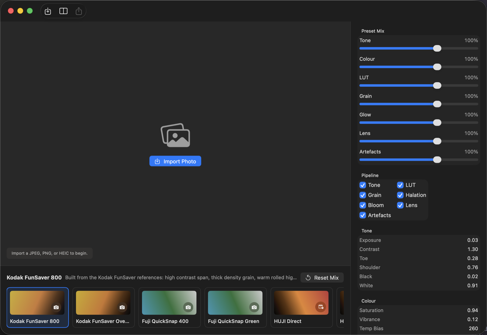
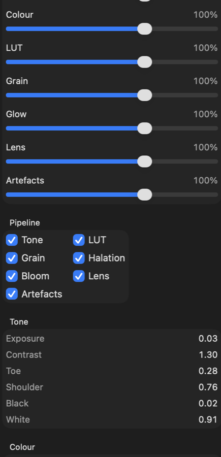

# FilmForge

FilmForge is a macOS film-camera editor built in SwiftUI and Core Image. It is tuned around disposable/film cameras.



## Highlights

- 24 reference-built film looks across Kodak FunSaver, Fuji QuickSnap, HUJI, Dazz, and imperfect lab-print families.
- Modular preset controls for Tone, Colour, LUT, Grain, Glow, Lens, and Artefacts instead of one blunt intensity slider.
- Scene-aware processing that adapts highlight rolloff, grain, bloom, halation, and colour response to the imported image.
- Core Image pipeline for tone curves, print response, LUT blending, camera response, halation, bloom, grain, chromatic aberration, edge softness, vignette, dust, scratches, leaks, and optional date stamps.
- Preview and export share the same rendering path, so what you tune is what you save.
- No artificial white flash-circle overlay.



## Preset Families

- Kodak disposable: FunSaver 800, Overexposed, Wedding, Low Light, Sun Haze.
- Fuji disposable: QuickSnap 400, QuickSnap Green, Coastal Blue, Selfie Print.
- HUJI style: Direct, Board Dark, Light Leak, Red Leak, Alley Green, Date Night.
- Dazz style: Organic, D Exp, CPM35, Night Market, Classic Room, DFuns Market, Soft Portrait, Parallax Dark.
- Print damage: Imperfect Lab Print.

## Build

The app can be built either as a Swift package or through the generated Xcode project.

```sh
swift test
swift run FilmForge --smoke-render
xcodegen generate
xcodebuild -project FilmForge.xcodeproj -scheme FilmForge -configuration Debug -derivedDataPath .xcode-derived build
open .xcode-derived/Build/Products/Debug/FilmForge.app
```

## Reference Analysis

The reference-image analyzer is included as a command-line mode:

```sh
swift run FilmForge --analyze-references references/film-look
```

It writes aggregate look metrics to `references/film-look/ANALYSIS.md` and `references/film-look/analysis.json`.

## Requirements

- macOS 13 or newer
- Xcode with Swift 5.9 support
- XcodeGen, for regenerating `FilmForge.xcodeproj`
